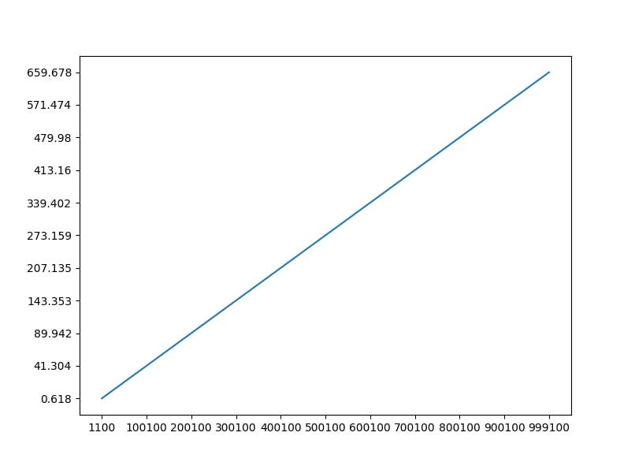
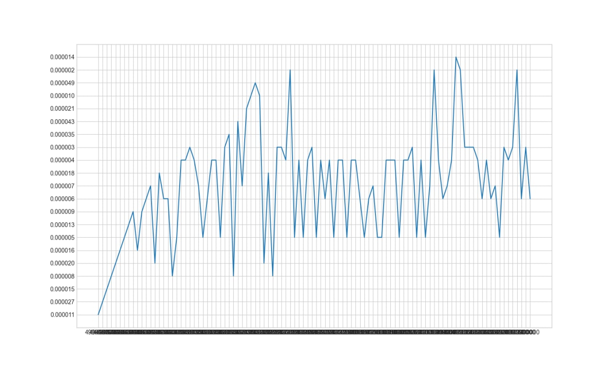

# Cartesian Trees

[](../../actions/workflows/cmake.yml)

_Декартово дерево - структура данных, объединяющая в себе бинарное
дерево поиска и бинарную кучу (сбалансированное дерево). Широко используется в базах данных,
так как имеет эффективный алгоритм поиска. Операции: добавление, удаление, разбиение, слияние,
очищение, наличие. Все основные методы имеют логарифмическую сложность. Данная структура широко используется в базах данных._

## Меместрои

Группа: 11-104

| Фамилия Имя      | Вклад (%) |     Прозвище |
|:-----------------|----------:|-------------:|
| Евстратова Дарья |        28 |       _босс_ |
| Новак Сергей     |        28 |    _Серджей_ |
| Липперт Марк     |        15 |        _бот_ |
| Талова Олеся     |        15 |      _олеся_ |
| Шакуров Амир     |        15 | _Shakur(ik)_ |

**Девиз команды**
> _У самурая нет цели, только путь..._

## Структура проекта

- [`src`](src) - реализация структуры данных;
- [`data`](data) - контрольные тесты производительности структуры данных;
- [`tests`](tests) - наборы данных для запуска контрольных тестов и их генерация;

## Требования

Рекомендуемые требования:

1. С++ компилятор c поддержкой стандарта C++17 (например, _GNU GCC 8.1.x_ и выше).
2. Система автоматизации сборки _CMake_ (версия _3.12.x_ и выше).
3. Интерпретатор _Python_ (версия _3.7.x_ и выше).
4. Рекомендуемый объем оперативной памяти - не менее 4 ГБ.
5. Свободное дисковое пространство объемом ~ 1 ГБ (для входного набора данных).

## Сборка и запуск

#### Сборка проекта

Склонируйте проект к себе на устройство через [Git for Windows](https://gitforwindows.org/) (либо используйте
возможности среды разработки):

```shell
git clone --recurse-submodules https://github.com/lippertmark/semester-project-cartesian-trees.git
```
Сборка и запуск проекта осуществляется через среду разработки.
_Откройте проект, запустите файл src/cartesian_tree.cpp для просмотра работы декартового дерева._

_Запустите tests/tests_cases.cpp для проверки правильности работы кода._

_Чтобы запустить демонстрационный пример откройте main.cpp_

####Контрольные тесты (data)
_Для запуска анализа времени работы программы нужно запустить analysis.cpp_
#### Генерация тестовых данных

_Формат данных: [txt](https://ru.wikipedia.org/wiki/%D0%A2%D0%B5%D0%BA%D1%81%D1%82%D0%BE%D0%B2%D1%8B%D0%B9_%D1%84%D0%B0%D0%B9%D0%BB)._
_Данные генерируются с помощью функций rand() и shuffle()_

##### Список контрольных тестов

| Название                       | Описание             | Метрики |
|:-------------------------------|----------------------|:--------|
| `decorator_insert_n_items`     | добавление элементов | _время_ |
| `decorator_contains_one_item`  | запрос Contains      | _время_ |
| `decorator_remove_one_item`    | удаление элемента    | _время_ |

_Результаты измерений представлены в файлах insert_time.txt, contains_time.txt, remove_time.txt_


_decorator_insert_n_items_


_decorator_contains_one_item_


_decorator_remove_one_item_
## Источники

_Список использованных при реализации структуры данных источников._

_[Википедия](https://neerc.ifmo.ru/wiki/index.php?title=%D0%94%D0%B5%D0%BA%D0%B0%D1%80%D1%82%D0%BE%D0%B2%D0%BE_%D0%B4%D0%B5%D1%80%D0%B5%D0%B2%D0%BE)_

_[Алгоритмы и структуры данных. Двоичное дерево поиска](https://www.youtube.com/watch?v=ub06cKtebKk)_

_[MAXimal](https://e-maxx.ru/algo/treap)_